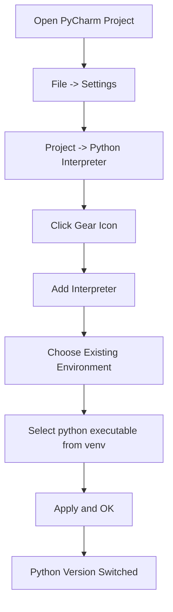

Adding different Python versions to PyCharm allows you to work with multiple Python environments in your projects. Here's how you can set up multiple Python versions in PyCharm:

1. Install multiple Python versions:
   First, ensure you have the desired Python versions installed on your system. You can use tools like pyenv or deadsnakes PPA to install multiple Python versions.

   For example, using deadsnakes PPA:
   ```
   sudo add-apt-repository ppa:deadsnakes/ppa
   sudo apt update
   sudo apt install python3.8 python3.9 python3.10
   ```

2. Open PyCharm and your project.

3. Set up virtual environments:
   It's a good practice to use virtual environments for each project. Here's how to create them:

   a. Open the Terminal in PyCharm (View -> Tool Windows -> Terminal)
   b. Create a virtual environment for each Python version:
      ```
      python3.8 -m venv venv38
      python3.9 -m venv venv39
      python3.10 -m venv venv310
      ```

4. Configure PyCharm to use these environments:
   a. Go to File -> Settings (on Windows/Linux) or PyCharm -> Preferences (on macOS)
   b. Navigate to Project: YourProjectName -> Python Interpreter
   c. Click the gear icon next to the Python Interpreter dropdown
   d. Select "Add"
   e. Choose "Existing Environment"
   f. Browse to the `bin/python` (or `Scripts\python.exe` on Windows) file in each of your virtual environments
   g. Add each environment

5. Switch between Python versions:
   You can now easily switch between Python versions for your project:
   a. Open the Python Interpreter settings as in step 4
   b. Select the desired interpreter from the dropdown menu

6. For different Python versions in different run configurations:
   a. Go to Run -> Edit Configurations
   b. Add a new configuration or edit an existing one
   c. In the "Python interpreter" section, select the specific interpreter for this run configuration




This diagram shows the steps to switch Python interpreters in PyCharm.

Remember, when working on different projects, it's a good practice to create separate virtual environments for each project to manage dependencies effectively.

Would you like more information on any part of this process?